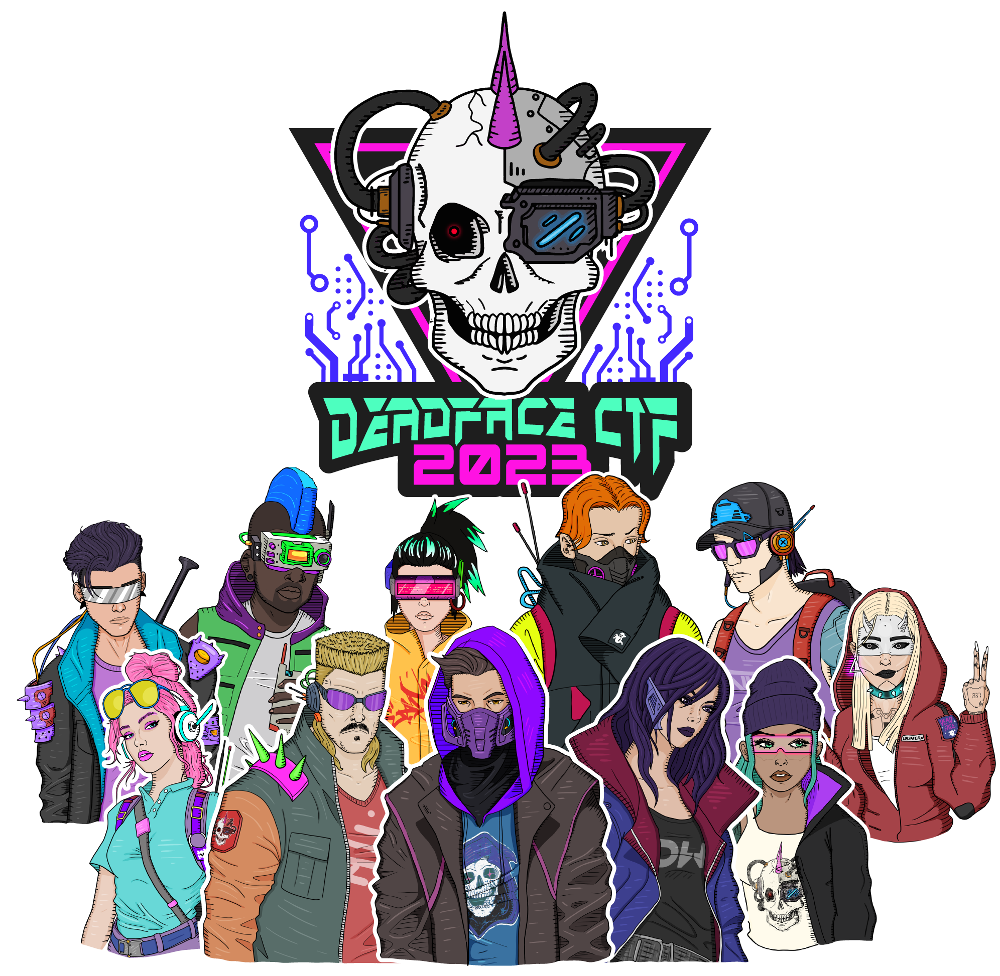

# DEADFACE CTF 2023

https://ctftime.org/event/2031

## Results

- team: Agartha
- 53/? flags (4882 points)
- 42/1107 team rank

## Flags (53/?)

Note: These were the challenges I had unlocked. Depending on a combination
of challenges you complete will unlock "hidden challenges".

So, I don't have all the writeups for ones I didn't complete and kind of gave up looking.

### Reverse Engineering (6/?)

- [x] [Cereal Killer 05](/rev/solved/cereal-killer-05/)
- [x] [Cereal Killer 01](/rev/solved/cereal-killer-01/)
- [x] [Gamertime: Cheat Code](rev/solved/gamertime-cheat-code/)
- [x] [My Daily Macros](rev/solved/my-daily-macros/)
- [x] [Cereal Killer 02](rev/solved/cereal-killer-02/)
- [ ] [STARvin for Secrets 1: Lindsey's Lyrics](rev/unsolved/starvin-for-secrets/)
- [x] [Cereal Killer 04](rev/solved/cereal-killer-04/)
- [ ] [Cereal Killer 03](rev/unsolved/cereal-killer-03/)
- [ ] [Cereal Killer 06](rev/unsolved/cereal-killer-06/)

### Capstone (0/1)

- [ ] [End of the Road](capstone/unsolved/end-of-the-road/)

### BONUS (1/?)

- [x] [Off the Rails](bonus/solved/off-the-rails/)
- [ ] [Lilith](bonus/unsolved/lilith/)
- [ ] [Zombie Math](bonus/unsolved/zombie-math/)
- [ ] [Lytton Labs: Dark Sarcasm](bonus/unsolved/lytton-labs-dark-sarcasm/)

### Pwn (3/?)

- [x] [Host Busters 3](pwn/solved/host-busters-3/)
- [x] [Host Busters 5](pwn/solved/host-busters-5/)
- [ ] [Scamazon 1](pwn/unsolved/scamazon-1/)
- [x] [Host Busters 4](pwn/solved/host-busters-4/)
- [ ] [Gamertime: Need for Speed](pwn/unsolved/gamertime-need-for-speed/)
- [ ] [Beat it, kid](pwn/unsolved/beat-it-kid/)
- [ ] [Internal](pwn/unsolved/internal/)

### Steganography (5/?)

- [x] [You've Been Ransomwared](steg/solved/youve-been-ransomwared/)
- [x] [Fetching Secrets](steg/solved/fetching-secrets/)
- [x] [Electric Steel](steg/solved/electric-steel/)
- [x] [Terms and Conditions May Apply](steg/solved/terms-and-conditions/)
- [x] [Syncopated Beat](steg/solved/syncopated-beat/)
- [ ] [Sneaky Static](steg/unsolved/sneaky-static/)
- [ ] [The Wisdom of Knox](steg/unsolved/the-wisdom-of-knox/)
- [ ] [The Pearl of Wisdom of Eliphaz](steg/unsolved/the-pearl-of-wisdom/)

### SQL (11/?)

- [x] [Aurora Compromise](sql/solved/aurora-compromise/)
- [x] [Foreign Keys](sql/solved/foreign-keys/)
- [x] [Credit Compromise](sql/solved/credit-compromise/)
- [x] [Starypax](sql/solved/starypax/)
- [x] [Transaction Approved](sql/solved/transcation-approved/)
- [x] [Genovex Profile](sql/solved/genovix-profits/)
- [x] [City Hoard](sql/solved/city-hoard/)
- [x] [Order Up](sql/solved/order-up/)
- [x] [Counting STARs](sql/solved/counting-stars/)
- [x] [Clean Up on Aisle 5](sql/solved/clean-up-on-aisle-5/)
- [x] [SHAttered Dreams](sql/solved/shattered-dreams/)

### Cryptography (7/?)

- [x] [Coin Code](crypto/solved/coin-code/)
- [x] [Letter Soup](crypto/solved/letter-soup/)
- [x] [B1Tz and B0tZ](crypto/solved/b1tz-and-b0tz/)
- [x] [Refill on Soup](crypto/solved/refill-on-soup/)
- [x] [HAM JAM](crypto/solved//ham-jam/)
- [x] [Color Me Impressed](crypto/solved/color-me-impressed/)
- [ ] [Off Again On Again](crypto/unsolved/off-again-on-again/)
- [ ] [Halloween +1](crypto/unsolved/halloween-1/)
- [ ] [Up in the Air](crypto/unsolved/up-in-the-air/)
- [x] [Reflections](crypto/solved/reflections/)
- [ ] [Slothy](crypto/unsolved/slothy/)

### Programming (1/?)

- [x] [Dead Drop](prog/solved/dead-drop/)
- [ ] [Chatty Cathy](prog/unsolved/chatty-cathy/)
- [ ] [The CDR of the CAR... RAH, RAH, RAH!!!](prog/unsolved/cdr/)

### Traffic Analysis (5/?)

- [x] [Sometimes IT Lets You Down](pcap/solved/sometimes-it/)
- [x] [Git Rekt](pcap/solved/git-rekt/)
- [x] [Creepy Crawling](pcap/solved/creepy-crawling/)
- [x] [UVB-76 (Hello are you there?)](pcap/solved/uvb-76/)
- [x] [Keys to the Kingdom](pcap/solved/keys-to-the-kingdom/)
- [ ] [Have a Cup of Coffee](pcap/unsolved/have-a-cup-of-coffee/)

### OSINT (8/?)

- [x] [Mama y Papa](osint/solved/mama-y-papa/)
- [x] [G(1)o Clouds!](osint/solved/go-clouds/)
- [x] [Nice Vacation](osint/solved/nice-vacation/)
- [x] [Take a Seat Upon the Throne](osint/solved/take-a-seat/)
- [x] [Black Hat](osint/solved/black-hat/)
- [x] [Dark_Web_Dump](osint/solved/dark-web-dump/)
- [ ] [Reveal Mirveal](osint/unsolved/reveal-mirveal/)
- [x] [Settle in the Presence of Evil](osint/solved/settle-in-the-presence-of-evil/)
- [x] [Feeling Lucky](osint/solved/feeling-lucky/)

### Forensics (4/?)

- [x] [What's the Wallet](forensics/solved/whats-the-wallet/)
- [x] [Host Busters 1](forensics/solved/host-busters-1/)
- [x] [Malum](forensics/solved/malum/)
- [x] [Tin Balloon](forensics/solved/tin-balloon/)
- [ ] [Host Busters 2](forensics/unsolved/host-busters-2/)

### Starter (2/2)

- [x] Starter 1 - rules page `flag{I_acknowledge_the_rules}`
- [x] Starter 2 - https://ghosttown.deadface.io/latest `flag{daem0n_0517}`

## Challenge Files

There were a lot of challenges...I didn't bother keeping the files...too much work to download them all
