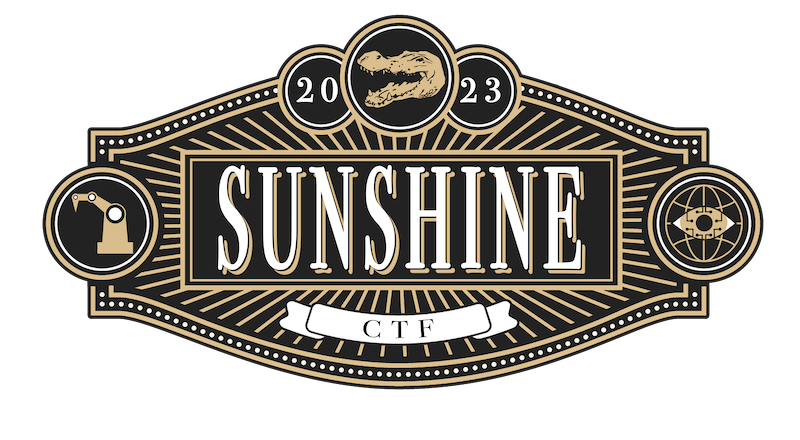

# sunshine-ctf-2023

https://2023.sunshinectf.org

## Results

- team: Agartha
- 8/17 flags (701 points)
- 105/821 team rank

## Flags (8/17)

CTF challenge files located in my private google drive.

### Misc (1/2)

- [x] Initialization - `sun{i_am_here}`
- [ ] [Knowledge Repository](misc/unsolved/knowledge-repository/)

### Crypto (1/1)

- [x] [BeepBoop Cryptography](crypto/solved/beepboop-cryptography/)

### Reversing (2/2)

- [x] [Dill](reversing/solved/dill/)
- [x] [First Date](reversing/solved/first-date/)

### Web (2/2)

- [x] [BeepBoop Blog](web/solved/beepboop-blog/)
- [x] [HotDog Stand](web/solved/hotdog-stand/)

### Scripting (2/4)

- [x] [DDR](scripting/solved/ddr/)
- [x] [Simon Programmer 1](scripting/solved/simon-programmer-1/)
- [ ] [Simon Programmer 2](scripting/unsolved/simon-programmer-2/)
- [ ] [Simon Programmer 3](scripting/unsolved/simon-programmer-3/)

### Pwn (0/5)

- [ ] [Array of Sunshine](pwn/unsolved/array-of-sunshine/)
- [ ] [Flock of Seagulls](pwn/unsolved/flock-of-seagulls/)
- [ ] [House of Sus](pwn/unsolved//house-of-sus/)
- [ ] [Bug Spray](pwn/unsolved/bug-spray/)
- [ ] [Robot Assembly Line](pwn/unsolved/robot-assembly-line/)

### Forensics (0/1)

- [ ] [Low Effort Wav](forensics/unsolved/low-effort-wav/)
